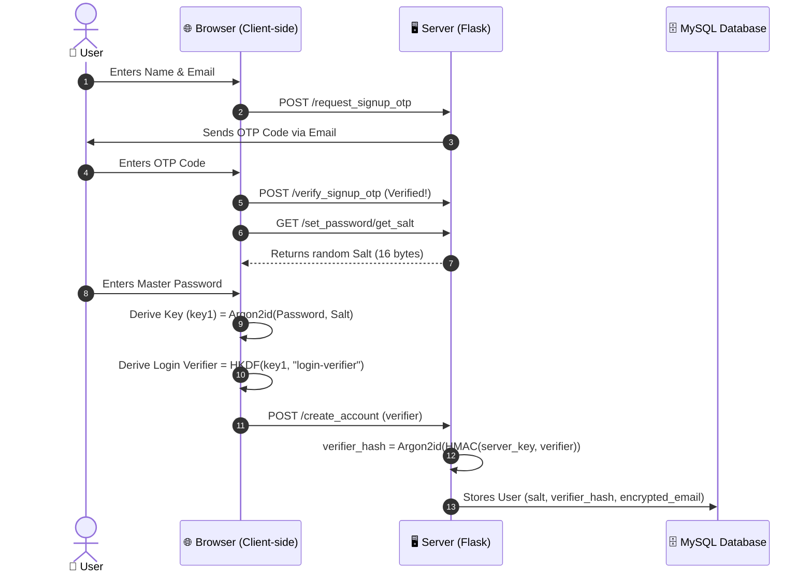
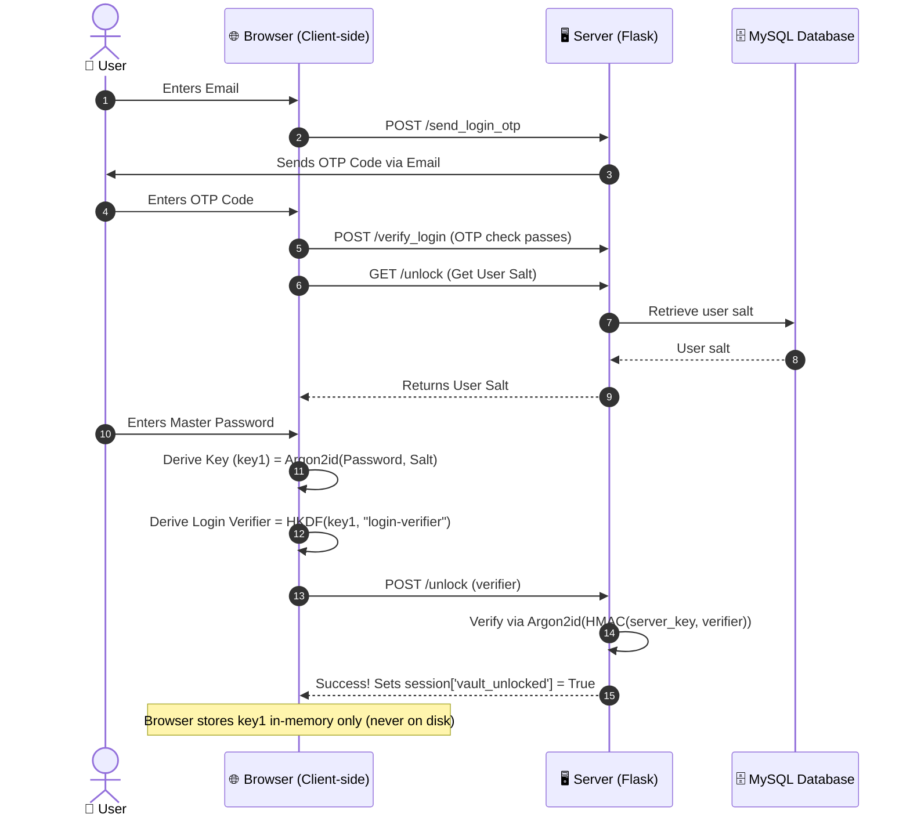
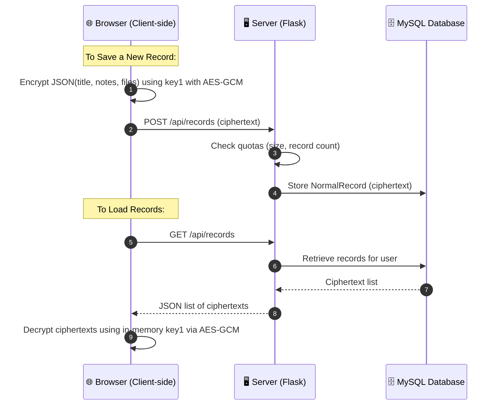

# 🔒 Zero-Knowledge Vault (zk-vault)

Welcome to **zk-vault**! This is a secure web application designed to store your passwords, notes, and secret files. 

What makes this vault special is that it is **Zero-Knowledge**. This means your passwords and files are encrypted *in your browser* before being sent to the server. The server never sees your actual passwords or keys, and it cannot read your stored data. Even if someone hacks the server or database, your information remains safe and unreadable!

---

## 📖 Table of Contents
1. [How It Works (For Beginners)](#-how-it-works-for-beginners)
2. [Security & Cryptographic Flow Chart](#-security--cryptographic-flow-chart)
3. [Security Features Checklist](#-security-features-checklist)
4. [Prerequisites (What you need installed)](#-prerequisites-what-you-need-installed)
5. [Step-by-Step Installation & Setup](#-step-by-step-installation--setup)
6. [Understanding the `.env` Configuration File](#-understanding-the-env-configuration-file)
7. [Running the Application](#-running-the-application)
8. [How to Use the App (User Guide)](#-how-to-use-the-app-user-guide)
9. [Security Best Practices for Hosting](#-security-best-practices-for-hosting)
10. [API Endpoint Reference (For Developers)](#-api-endpoint-reference-for-developers)
11. [Troubleshooting Common Issues](#%EF%B8%F0-troubleshooting-common-issues)

---

## 🧠 How It Works (For Beginners)

To understand why this system is so secure, think of it as a physical safe box:

1. **Creating the Key (Key Derivation):** When you sign up, your browser takes your Master Password and a unique random "salt" (a random starting value) and runs it through a slow mathematical algorithm called **Argon2id**. This generates a strong 256-bit cryptographic key (called `key1`).
2. **Locking the Box (Encryption):** Your browser uses `key1` to encrypt your files and credentials using **AES-GCM** (an unbreakable digital lock). This encrypted chunk of text looks like random garbage.
3. **Sending the Box to the Server:** The browser sends only the encrypted "random garbage" to the server. The server stores this in the database.
4. **Proving Who You Are (Verifiers):** To log in, the browser derives a separate value called a **Login Verifier** using **HKDF** (a one-way formula) from your `key1` and sends it to the server. The server stores a hash of this verifier. When you log in, the server matches the verifier to prove you know the password, but the server *never* learns `key1` or your password.

> [!CAUTION]
> **⚠️ CRITICAL WARNING: NO PASSWORD RESET!**
> Because this is a Zero-Knowledge Vault, your master password **never leaves your device** and is never stored on the server. 
> There is **no "Forgot Password" or "Reset Password" button**. If you lose or forget your Master Password, **your encrypted vault data is permanently locked and cannot be recovered by anyone, including the server administrators.** Write down your password in a safe physical location!

---

## 📊 Security & Cryptographic Flow Chart

The system divides cryptographic events into three clear, distinct phases to ensure user secrets never reach the server:

### 1. Account Creation (Signup)
This flow shows how a user establishes their identity and registers their salt and verifier:



---

### 2. Vault Unlocking (Login)
This flow shows how a user proves password ownership to open their local vault:



---

### 3. Vault Data Operations (Save & Load)
This flow shows how records are saved and loaded securely after the vault is unlocked:



---

## 🛡️ Security Features Checklist

This application implements several advanced security practices to keep your vault safe:

* **Zero-Knowledge Architecture:** Cryptographic encryption and key derivation happen strictly inside the browser. No plaintext secrets or keys are sent to or stored on the server.
* **Double-Layer Password Protection:** The database stores password verifiers hashed using Argon2id. Furthermore, a server-side `VERIFIER_HMAC_KEY` is mixed into the verifier hash, meaning an attacker who steals only the database cannot run offline dictionary attacks.
* **Email Address Encryption (At Rest):** User email addresses are encrypted at rest in the database using the server's `EMAIL_ENCRYPTION_KEY`, and indexed via a salted `EMAIL_INDEX_KEY` HMAC. This prevents mass email leaks.
* **Brute-Force Lockouts:** Accounts are locked automatically for increasing durations (30 minutes, 24 hours, up to 1 year/permanent lockout) after multiple incorrect password attempts.
* **Form CSRF Protection:** All input forms are secured with token validation using `Flask-WTF` to block Cross-Site Request Forgery.
* **Strict Content Security Policy (CSP):** Employs strict CSP headers via `Flask-Talisman` with dynamic scripts nonces to block Cross-Site Scripting (XSS) and code injection, and disables remote CDN script loading.
* **Server-Side Sessions (Redis):** Login session data is kept in memory on Redis rather than in browser cookies, preventing session hijacking or manipulation.
* **SSRF (Server-Side Request Forgery) Hardening:** Restricts disposable email domain checking to a hardcoded domain with zero redirects and short timeouts, blocking SSRF vulnerabilities.
* **Rate Limiting:** Protects sensitive server routes (like OTP generation and logins) using `Flask-Limiter` to prevent automated scraping or denial of service.

---

## 🛠️ Prerequisites

Before setting up the project, make sure you have the following installed on your computer:

* **Python 3.8 or higher**: The programming language used to run the backend server.
* **MySQL** (or MariaDB): The database server used to store users and encrypted vault items.
* **Redis**: A high-performance temporary memory database used to keep track of active logins and security codes (OTPs).

---

## 🚀 Step-by-Step Installation & Setup

Follow these steps carefully to run the vault on your computer.

### Step 1: Download the Project
Make sure the project files are located in your workspace directory (e.g., `d:\python project\s`).

### Step 2: Open a Terminal / Command Prompt
Open your terminal (PowerShell, Command Prompt, or terminal in VS Code) and navigate to the project directory:
```powershell
cd "d:\python project\s"
```

### Step 3: Create a Python Virtual Environment
A virtual environment is like an isolated sandbox for this project. It ensures that the software packages installed for this project don't conflict with other projects.
Run the following command:
```powershell
python -m venv .venv
```

### Step 4: Activate the Virtual Environment
To tell your computer to use this isolated sandbox, you need to activate it:
* **Windows (PowerShell):**
  ```powershell
  .venv\Scripts\Activate.ps1
  ```
* **Windows (Command Prompt):**
  ```cmd
  .venv\Scripts\activate.bat
  ```
* **Mac/Linux:**
  ```bash
  source .venv/bin/activate
  ```
*(You will see `(.venv)` appear at the beginning of your terminal line once activated).*

### Step 5: Install Python Dependencies
Install all the required software packages listed in `requirements.txt`:
```powershell
pip install -r requirements.txt
```

---

## ⚙️ Understanding the `.env` Configuration File

Create a file named `.env` in the root of the `s` directory. This file stores configuration secrets (like database passwords and cryptographic keys). **Never share or commit this file to public places like GitHub!**

Copy the template below and paste it into your `.env` file, replacing the values with your own:

```env
# Flask Secret Key (Used for session signing)
SECRET_KEY=ReplaceThisWithALongRandomString1234!

# Server-Side HMAC Key (Base64 encoded, 32 bytes)
# Used to secure password verifiers stored in the database.
VERIFIER_HMAC_KEY=base64-encoded-32-byte-key-here==

# CSRF Secret Key (Protects website forms from unauthorized cross-site actions)
WTF_CSRF_SECRET_KEY=AnotherLongRandomStringHereForCSRFProtect

# Redis Connection URL
REDIS_URL=redis://localhost:6379/0

# Database Configuration (MySQL)
MYSQL_HOST=localhost
MYSQL_USER=your_mysql_username
MYSQL_PASSWORD=your_mysql_password
MYSQL_DB=your_database_name

# Email configuration (Used to send OTP verification codes and alerts)
MAIL_SERVER=smtp.gmail.com
MAIL_PORT=587
MAIL_USE_TLS=True
MAIL_USERNAME=your_gmail_address@gmail.com
MAIL_PASSWORD=your_gmail_app_password  # For Gmail, use an "App Password", not your main password!

# Server-Side Encryption Keys (Base64 encoded, 32 bytes)
# Used to encrypt and index email addresses inside the database.
EMAIL_ENCRYPTION_KEY=32_byte_base64_encryption_key_here=
EMAIL_INDEX_KEY=32_byte_base64_indexing_key_here=

# Storage Quotas (Optional, defaults will be used if left blank)
MAX_RECORDS_PER_USER=1000
MAX_STORAGE_PER_USER_MB=100
```

> [!TIP]
> **How do I generate a random 32-byte Base64 key?**
> You can generate secure cryptographic keys by running this command in your active terminal:
> ```powershell
> python -c "import os, base64; print(base64.b64encode(os.urandom(32)).decode())"
> ```
> Use this command to generate values for `VERIFIER_HMAC_KEY`, `EMAIL_ENCRYPTION_KEY`, and `EMAIL_INDEX_KEY`.

---

## 🏃 Running the Application

### 1. Start MySQL and Redis
Ensure that both your **MySQL** and **Redis** services are running on your computer.

### 2. Create the Database Tables
You don't need to manually create database tables! The application will automatically create all tables in MySQL matching the database name specified in `MYSQL_DB` when you first run the server.

### 3. Run the Flask Server
Make sure your virtual environment is active, then run:
```powershell
python app.py
```
By default, the application will start and print a local web URL. Typically, it is:
👉 **[http://127.0.0.1:5000](http://127.0.0.1:5000)**

Open this URL in your web browser!

---

## 📱 How to Use the App (User Guide)

When you open the vault app, here is the basic flow:

1. **Sign Up:**
   * Enter your name and email address.
   * You will receive a 6-digit One-Time Password (OTP) in your email.
   * Enter the OTP to verify your email.
   * Choose a strong **Master Password**. The page will generate your login keys locally.
2. **Log In:**
   * Enter your registered email.
   * Enter the OTP sent to your email.
   * Enter your **Master Password** to unlock your vault.
3. **Managing Your Vault:**
   * Click **Add New Record** to store passwords, login credentials, or secret notes.
   * Your data is encrypted immediately in your browser before saving to the database.
   * You can edit or delete your records at any time.
4. **Security Lockouts:**
   * If you type your vault master password incorrectly too many times, the app will temporarily lock your vault to protect it from guessing attacks. Wait times increase with each consecutive failure (30 minutes, 24 hours, etc.).

---

## 🔒 Security Best Practices for Hosting

If you are planning to deploy or self-host this application, follow these guidelines to keep the vault secure:

1. **Protect your `.env` file:** 
   Ensure your `.env` file is excluded from your git repository. Add `.env` to a `.gitignore` file so you do not accidentally publish your encryption keys on GitHub.
2. **Run on HTTPS (SSL/TLS):** 
   You must set up SSL/TLS (HTTPS) when hosting this app publicly. Without HTTPS, data sent over the network (like OTP codes and login verifiers) can be intercepted by attackers on the same network.
3. **Keep Regular Backups:** 
   Regularly back up your MySQL database and Redis configurations. Because the database contains encrypted user vaults, if the database is corrupted or deleted, all user vaults are permanently gone.
4. **Generate Strong Encryption Keys:** 
   Do not use the placeholder keys in `.env` for production. Always run the key-generator command to create fresh, random 32-byte keys for your environment.

---

## 🔌 API Endpoint Reference (For Developers)

The web client communicates with the server using standard JSON REST endpoints. All endpoints under `/api/` require a logged-in user session.

### Authentication & Keys
* **`POST /get_signup_salt`**
  * *Description:* Fetches the encryption salt for an email.
  * *Request Body:* `{"email": "user@example.com"}`
  * *Response:* `{"salt": "base64_salt_string"}`
  
### Normal Vault Items (`/api/records`)
* **`GET /api/records`**
  * *Description:* List all encrypted records in the normal vault.
  * *Response:* `[{"id": "rec_123", "payload": "encrypted_base64_payload", "size": 1024, "created_at": "..."}]`
* **`POST /api/records`**
  * *Description:* Save a new encrypted record.
  * *Request Body:* `{"payload": "encrypted_base64_payload", "size": 1024}`
  * *Response:* `{"status": "success", "id": "rec_123"}`
* **`DELETE /api/records/<record_id>`**
  * *Description:* Permanently delete an encrypted record.
  * *Response:* `{"status": "deleted"}`

### Secret Vault Items (`/api/secret-records`)
* **`GET /api/secret-records`**
  * *Description:* List all encrypted records inside the secondary "Secret" partition.
  * *Response:* `[{"id": "sec_123", "payload": "encrypted_base64_payload", "size": 512}]`
* **`POST /api/secret-records`**
  * *Description:* Save a new record in the secret partition.
  * *Request Body:* `{"payload": "encrypted_base64_payload", "size": 512}`

---

## 🛠️ Troubleshooting Common Issues

### ❌ `RedisError: Connection Refused`
* **Why:** The Flask app is running, but it cannot connect to Redis.
* **Fix:** Make sure your Redis server is started. On Windows, you can start it by running the `redis-server` command in a separate terminal window, or starting the Redis service from Windows Services.

### ❌ `OperationalError: (pymysql.err.OperationalError) (1049, "Unknown database '...'")`
* **Why:** MySQL is running, but the database schema configured in your `.env` (`MYSQL_DB`) doesn't exist yet.
* **Fix:** Connect to MySQL using a database client (like DBeaver, MySQL Workbench, or command line) and run:
  ```sql
  CREATE DATABASE your_database_name;
  ```

### ❌ No emails are being received
* **Why:** The SMTP settings for sending emails are incorrect, or Gmail is blocking the connection.
* **Fix:** Ensure `MAIL_USERNAME` and `MAIL_PASSWORD` are correct. If using Gmail, you must generate a special **App Password** from your Google Account settings (under Security > 2-Step Verification > App passwords) instead of typing your regular account password.
