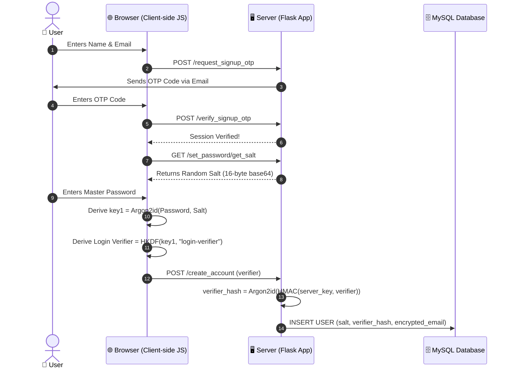
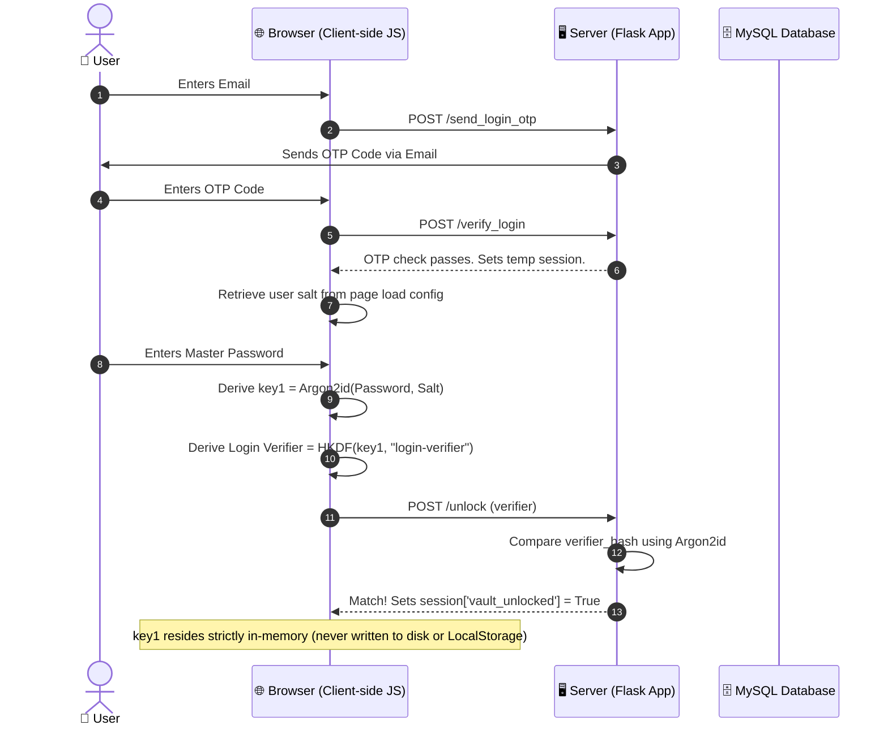
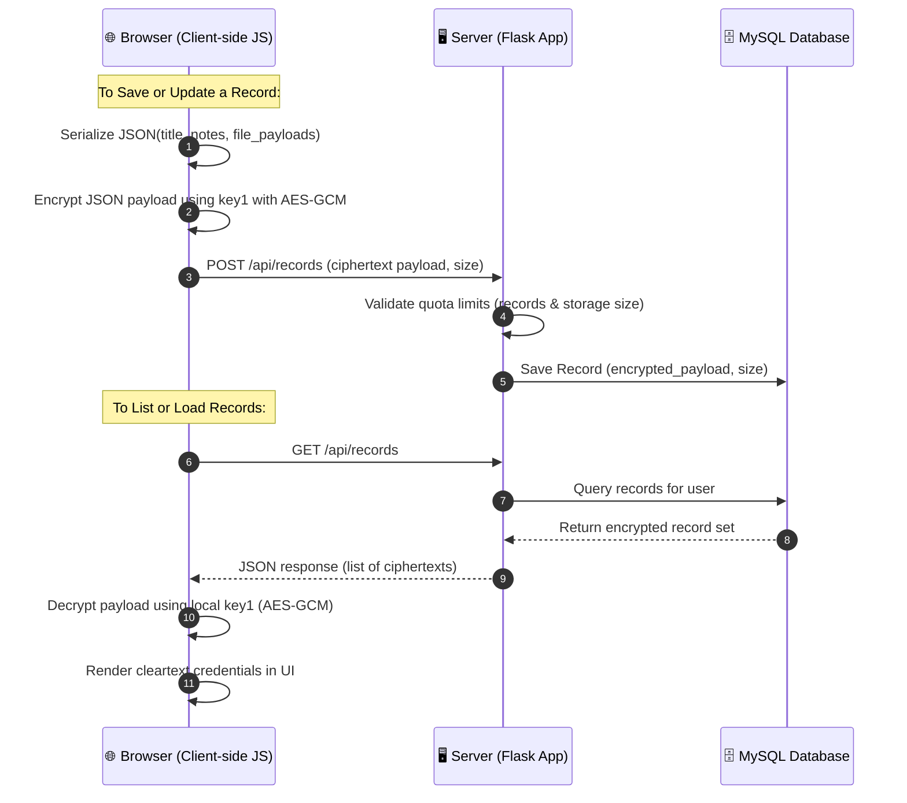

# 🔒 zk-vault

Zero-knowledge encrypted vault for credentials, notes, and files. Encryption and key derivation run in the browser; the server stores ciphertext and a hashed login verifier only.

> [!CAUTION]
> **NO PASSWORD RESET — BY DESIGN.** Your master password never leaves your device. If you lose it, your vault contents are permanently unrecoverable.

---

## The Problem

Server-side password managers expose all secrets if the database or admin is compromised. zk-vault keeps keys on the client so a database breach yields only ciphertext.

---

## Threat Model

| Asset | Adversary | Mitigation |
|---|---|---|
| Vault contents | DB thief / curious admin | AES-256-GCM client-side; server never sees the key |
| Master password | Offline cracker with DB | Argon2id (client) + Argon2id over HMAC'd verifier (server pepper) |
| Login verifier | DB thief | Argon2id server-side hash + optional HMAC pepper ties hash to server secret |
| Email addresses | DB thief | AES-GCM encrypted at rest + HMAC-indexed (plaintext never stored) |
| Sessions | XSS, CSRF, fixation | Nonce-based CSP, CSRF tokens, HttpOnly/Secure/SameSite=Strict, Redis server-side sessions |
| Accounts | Online brute force | Rate limiting, OTP attempt caps, escalating lockouts (30 min → 24 h → 7 d → 1 yr) |

### Known Limits (read these)

- **A malicious or compromised server can serve modified JavaScript and steal your key.** This is the standard limit of all browser-based E2EE. Mitigations (Subresource Integrity, browser extension, native client) are future work.
- **No password recovery.** By design.
- **Ciphertext byte-size is stored in cleartext** for quota enforcement — metadata leak.
- **GeoIP lookup sends alert-email IPs to `ipapi.co`** over HTTPS. Drop `get_ip_location` if you consider this a privacy issue.
- **Not independently audited.** Use accordingly.
- **A `docker-compose.yml` is provided** to easily spin up the app, MySQL, and Redis, or you can run it manually.

---

## 📊 Cryptographic Sequence Diagrams

The vault divides its operations into three distinct flows to guarantee that raw passwords never touch the wire.

### 1. Account Creation & Onboarding
Establishes the user identity, generates the client salt, and registers the server-side login verifiers.



---

### 2. Vault Unlocking & Local Session Keys
Logs the user into the server session and establishes the local cryptographic key inside browser memory.



---

### 3. Encrypted Vault Data Operations
Handles reading and writing of records. Payload data contains both metadata and file attachments.



---

## 🛡️ Security Features (as implemented)

- **Client-side KDF** — Argon2id (64 MB, 3 iterations, 1 parallelism) in WASM
- **HKDF-derived login verifier** — raw password never leaves the browser
- **Server-side HMAC pepper** — optional `VERIFIER_HMAC_KEY`; ties the verifier hash to a server secret so a stolen DB alone cannot run offline attacks
- **AES-256-GCM** with a fresh 12-byte IV per encryption operation
- **Email encrypted at rest** — AES-GCM + HMAC index; plaintext email never stored in DB
- **Email addresses masked in log files** — logs show `u***@example.com`, not plaintext
- **OTP timing-safe comparison** — `hmac.compare_digest` used for all OTP checks
- **UTC timestamps** — all lockout comparisons use `datetime.utcnow()`
- **CSRF** — Flask-WTF tokens on all forms
- **Nonce-based CSP** + HSTS + `X-Frame-Options: DENY` + `X-Content-Type-Options: nosniff`
- **Redis server-side sessions** — session data never in browser cookie
- **Escalating lockouts** — 30 min → 24 h → 7 d → 1 yr after repeated failures, with row locking
- **Rate limiting** — Flask-Limiter on OTP and login routes
- **Input-length validation** before hashing to prevent DoS via oversized inputs
- **SSRF hardening** on disposable-email check — hardcoded URL, no redirects, short timeout

---

## Architecture

```
Browser (Argon2id WASM · HKDF · AES-GCM)
    ↓ HTTPS
Flask (CSRF · CSP · rate-limit · session)
    ↓
MySQL  ←  ciphertext, verifier hashes, encrypted emails
Redis  ←  sessions, OTP codes, rate limits, activity logs
```

---

## 🛠️ Prerequisites

- Python 3.11+
- MySQL 8.0+ or MariaDB
- Redis 7+
- Node.js & npm (only if modifying frontend assets)

---

## 🚀 Installation & Setup

### 1. Generate cryptographic keys
Run this command **three times** to generate three independent 32-byte keys:
```powershell
python -c "import os, base64; print(base64.b64encode(os.urandom(32)).decode())"
```

### 2. Configure `.env`
Copy `.env.example` to `.env` and fill in your generated keys and SMTP credentials.
```powershell
cp .env.example .env
```

### 3. Run with Docker (Recommended)
Make sure Docker Desktop is running, then just run:
```powershell
docker-compose up -d --build
```
Open [http://127.0.0.1:5000](http://127.0.0.1:5000). The database and Redis will be created automatically.

---

### 3 (Alternative). Run Manually without Docker
```sql
CREATE DATABASE secure_vault CHARACTER SET utf8mb4 COLLATE utf8mb4_unicode_ci;
```

### 2. Set up Python virtual environment
```powershell
python -m venv .venv

# Activate (PowerShell)
.venv\Scripts\Activate.ps1

# Activate (bash/macOS)
source .venv/bin/activate

pip install -r requirements.txt
```

### 3. Generate cryptographic keys
Run this command **three times** to generate three independent 32-byte keys:
```powershell
python -c "import os, base64; print(base64.b64encode(os.urandom(32)).decode())"
```

### 4. Configure `.env`
Copy `.env.example` and fill in your values:
```powershell
cp .env.example .env
```

```env
# Flask
SECRET_KEY=<32-byte-random-string>
WTF_CSRF_SECRET_KEY=<another-32-byte-random-string>
FORCE_HTTPS=false

# Cryptographic keys (base64, 32 bytes each)
VERIFIER_HMAC_KEY=<generated-key-1>
EMAIL_ENCRYPTION_KEY=<generated-key-2>
EMAIL_INDEX_KEY=<generated-key-3>

# Redis
REDIS_URL=redis://localhost:6379/0

# MySQL
MYSQL_HOST=localhost
MYSQL_USER=your_mysql_user
MYSQL_PASSWORD=your_mysql_password
MYSQL_DB=secure_vault

# SMTP (Gmail App Password recommended)
MAIL_SERVER=smtp.gmail.com
MAIL_PORT=587
MAIL_USE_TLS=True
MAIL_USERNAME=your_sender@gmail.com
MAIL_PASSWORD=your_app_password

# Quotas
MAX_RECORDS_PER_USER=1000
MAX_STORAGE_PER_USER_MB=100
```

### 5. Run
```powershell
python app.py
```
Open [http://127.0.0.1:5000](http://127.0.0.1:5000).

### 6. Reset database (development only)
```powershell
python wipe_db.py
```
Prompts for confirmation. Never run in production.

---

## 🧪 Verification & Testing

### Integration test
Requires a running Flask server and Redis. Reads OTP codes directly from Redis (no real email needed):
```powershell
python test_app.py
```

### CI (GitHub Actions)
Every push runs:
- `pytest` — integration tests
- `bandit` — static security analysis
- `pip-audit` — dependency vulnerability scan
- `gitleaks` — secret detection in git history

See `.github/workflows/ci.yml`.

> [!NOTE]
> CI test results and `bandit`/`pip-audit` output will be pasted here once a run completes on the public repo.

---

## Structure

```
s/
├── app.py               # Flask application
├── test_app.py          # Integration test script
├── wipe_db.py           # Dev DB reset utility
├── mysql.txt            # Schema reference (for manual inspection)
├── requirements.txt     # Python dependencies
├── .env.example         # Environment variable template
├── static/              # Client-side JS (Argon2 WASM, AES-GCM)
├── templates/           # Jinja2 HTML templates
└── .github/
    └── workflows/
        └── ci.yml       # CI pipeline
```

---

## 🔌 API Endpoint Reference

All `/api/` endpoints require `session['vault_unlocked'] == True`.

### Authentication
| Method | Endpoint | Description |
|---|---|---|
| `POST` | `/request_signup_otp` | Send OTP to email for signup |
| `POST` | `/verify_signup_otp` | Validate signup OTP |
| `GET` | `/set_password/get_salt` | Fetch random Argon2 salt for signup |
| `POST` | `/create_account` | Register verifier hash |
| `POST` | `/send_login_otp` | Send OTP to email for login |
| `POST` | `/verify_login` | Validate login OTP |
| `POST` | `/unlock` | Verify login verifier and unlock vault |

### Vault Operations
| Method | Endpoint | Description |
|---|---|---|
| `GET` | `/api/records` | List all records (ciphertext) |
| `POST` | `/api/records` | Create a new record |
| `PUT` | `/api/records/<id>` | Update a record |
| `DELETE` | `/api/records/<id>` | Delete a record |
| `GET` | `/api/records/<id>/file/<int:idx>` | Fetch file payload within a record |

### Secret Partition
| Method | Endpoint | Description |
|---|---|---|
| `GET` | `/api/secret/get_salt` | Fetch second vault salt |
| `POST` | `/secret/setup` | Set up secret vault credentials |
| `POST` | `/secret/unlock` | Unlock secret partition |
| `GET` | `/api/secret/records` | List secret records |
| `POST` | `/api/secret/records` | Save secret record |
| `DELETE` | `/api/secret/records/<id>` | Delete secret record |

### Utilities
| Method | Endpoint | Description |
|---|---|---|
| `POST` | `/api/change_password` | Client-side re-encrypt + batch update |
| `GET` | `/api/user_quota` | Storage quota usage |
| `POST` | `/delete_account` | Permanently delete account |
| `GET` | `/logout` | End session |

---

## 🔍 Troubleshooting

**`RedisError: Connection Refused`** — Redis is not running. Start it with `redis-server`.

**`OperationalError: Unknown database 'secure_vault'`** — Create the DB manually:
```sql
CREATE DATABASE secure_vault;
```

**OTP emails not arriving** — Ensure `MAIL_USERNAME` / `MAIL_PASSWORD` are correct. Gmail requires an [App Password](https://support.google.com/accounts/answer/185833) (not your main password).

---

## 🗺️ Roadmap

- [ ] Alembic migrations (replace `create_all` + `ALTER TABLE at import`)
- [x] Docker Compose file
- [ ] Subresource Integrity (SRI) for client bundle
- [ ] WebAuthn second factor
- [ ] Independent security review

---

## Author

**Tiruveedhi Neeraj Venkata Sai**
- GitHub: [@neerajsait](https://github.com/neerajsait)

## License

MIT — see [LICENSE](LICENSE).
