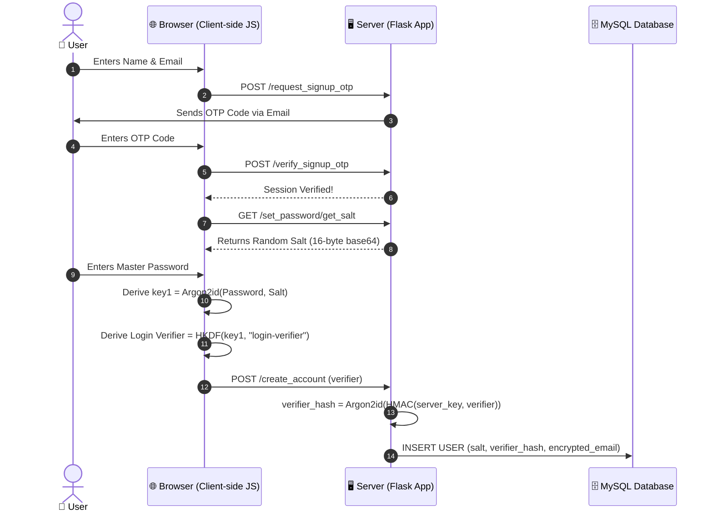
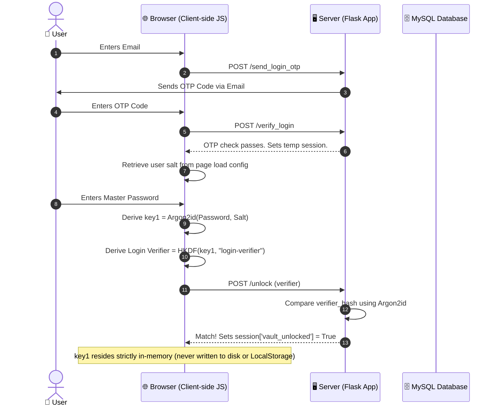
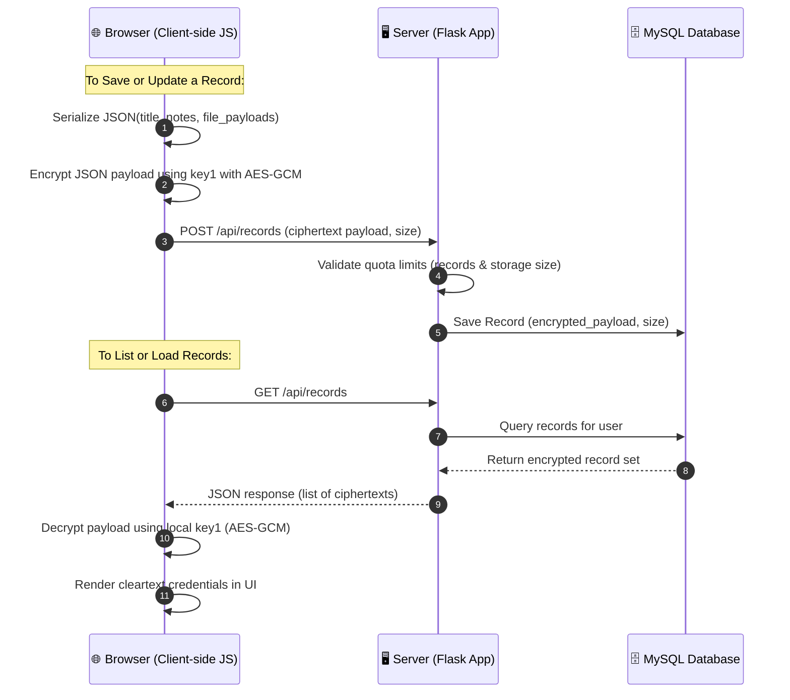

# 🔒 Zero-Knowledge Vault (zk-vault)

Welcome to **zk-vault**! A production-grade, highly secure, zero-knowledge web application designed for storing credentials, notes, and secret files. 

What makes this vault special is its **Zero-Knowledge Architecture**. All cryptographic operations (key derivation, encryption, and decryption) occur directly inside your browser. Your plain text passwords and files are never transmitted to the server. The backend only sees and stores encrypted blobs and hashes of derived verifiers. Even in the event of a full database breach, your records remain completely safe and unreadable.

---

## 📖 Table of Contents

1. [Architectural Overview (How It Works)](#-architectural-overview-how-it-works)
2. [Cryptographic Sequence Diagrams](#-cryptographic-sequence-diagrams)
3. [Security Hardening Features](#-security-hardening-features)
4. [Prerequisites](#-prerequisites)
5. [Step-by-Step Installation & Setup](#-step-by-step-installation--setup)
6. [Environment Configuration (`.env`)](#-environment-configuration-env)
7. [Running the Application](#-running-the-application)
8. [Database Schema (`mysql.txt`)](#-database-schema-mysqltxt)
9. [Verification & Testing (`test_app.py`)](#-verification--testing-test_appy)
10. [API Endpoint Reference](#-api-endpoint-reference)
11. [Troubleshooting Common Issues](#-troubleshooting-common-issues)
12. [Security Policy & Threat Model (SECURITY.md)](#-security-policy--threat-model)

---

## 🧠 Architectural Overview (How It Works)

The vault ensures total privacy by establishing two layers of isolation: client-side processing for user secrets, and server-side hardening for authentication verification and rate limiting.

1. **Key Derivation (Argon2id):** When you sign up, your browser takes your Master Password and a unique random 16-byte salt and runs it through **Argon2id** (configured for 64MB memory, 3 iterations, 1 parallelism). This yields a 256-bit cryptographic master key (`key1`).
2. **Local Encryption (AES-GCM):** Before any vault entry or file leaves your computer, it is serialized into a JSON envelope and encrypted locally via **AES-GCM (256-bit)** using `key1`. The browser generates a fresh 12-byte initialization vector (IV) for every encryption operation.
3. **Authentication via Login Verifiers:** Instead of sending your password to authenticate, the client derives a secondary key using **HKDF-SHA256** from `key1` with the info label `login-verifier`. The server stores a double-hashed version of this verifier (further secured with a server-side HMAC secret).
4. **Zero-Knowledge Password Changes:** To change your password, the client downloads all encrypted payloads, decrypts them locally using the old key, re-encrypts them with the new key (derived from the new password and a new salt), and sends them in a single batch transaction to the server. The server replaces the salt, the verifier, and the encrypted payloads atomically.

> [!CAUTION]
> **⚠️ CRITICAL WARNING: NO PASSWORD RESET PATHWAY**
> Because this is a zero-knowledge architecture, your master password **never leaves your device** and is never known by the server. 
> There is **no "Reset Password" button**. If you forget your Master Password, **your stored vault items are permanently lost**. No administrator or developer can decrypt them.

---

## 📊 Cryptographic Sequence Diagrams

The vault divides its operations into three distinct flows to guarantee that raw passwords never touch the wire.

### 1. Account Creation & Onboarding
Establishes the user identity, generates the client salt, and registers the server-side login verifiers.



---

### 2. Vault Unlocking & Local Session Keys
Logs the user into the server session and establishes the local cryptographic key inside browser memory.



---

### 3. Encrypted Vault Data Operations
Handles reading and writing of records. Payton data contains both metadata and file attachments.



---

## 🛡️ Security Hardening Features

This application implements rigorous security safeguards to counter a wide array of web vulnerabilities:

* **Zero-Knowledge Architecture:** Cryptographic encryption and key derivation occur strictly inside the browser. No plaintext secrets or keys are sent to or stored on the server.
* **Double-Layer Password Protection:** The database stores password verifiers hashed using Argon2id. Furthermore, a server-side `VERIFIER_HMAC_KEY` is mixed into the verifier hash, meaning an attacker who steals only the database cannot run offline dictionary attacks.
* **Email Address Encryption (At Rest):** User email addresses are encrypted at rest in the database using the server's `EMAIL_ENCRYPTION_KEY`, and indexed via a salted `EMAIL_INDEX_KEY` HMAC. This prevents mass email leaks.
* **Brute-Force Lockouts:** Accounts are locked automatically for increasing durations (30 minutes, 24 hours, up to 1 year/permanent lockout) after multiple incorrect password attempts.
* **Form CSRF Protection:** All input forms are secured with token validation using `Flask-WTF` to block Cross-Site Request Forgery.
* **Strict Content Security Policy (CSP):** Employs strict CSP headers via `Flask-Talisman` with dynamic scripts nonces to block XSS and code injection, and disables remote CDN script loading.
* **Server-Side Sessions (Redis):** Login session data is kept in memory on Redis rather than in browser cookies, preventing session hijacking or manipulation.
* **SSRF (Server-Side Request Forgery) Hardening:** Restricts disposable email domain checking to a hardcoded domain with zero redirects and short timeouts, blocking SSRF vulnerabilities.
* **Rate Limiting:** Protects sensitive server routes (like OTP generation and logins) using `Flask-Limiter` to prevent automated scraping or denial of service.

---

## 🛠️ Prerequisites

To run this project, make sure you have the following services and software installed locally:

* **Python 3.8+**
* **MySQL 8.0+** or MariaDB
* **Redis** (Used for session storage and rate limiting)
* **Node.js & npm** (For executing local frontend components if utilizing dev tools)

---

## 🚀 Step-by-Step Installation & Setup

### 1. Configure the Database
Log into your local MySQL CLI or desktop client and run:
```sql
CREATE DATABASE secure_vault CHARACTER SET utf8mb4 COLLATE utf8mb4_unicode_ci;
```

### 2. Set Up Python Virtual Environment
Navigate to the `s` directory and run:
```powershell
# Create venv
python -m venv .venv

# Activate venv (PowerShell)
.venv\Scripts\Activate.ps1

# Activate venv (bash/mac)
source .venv/bin/activate

# Install dependencies
pip install -r requirements.txt
```

### 3. Generate Cryptographic Secret Keys
Generate cryptographically strong keys for your `.env` configuration file by running:
```powershell
python -c "import os, base64; print(base64.b64encode(os.urandom(32)).decode())"
```
Run this command 3 times to get 3 unique keys for the configuration.

---

## ⚙️ Environment Configuration (`.env`)

Create a `.env` file in the root of the `s` folder. Copy the parameters from your newly generated keys and configure your local settings:

```env
# Flask Settings
SECRET_KEY=ReplaceWithRandomString32CharsOrMore!
WTF_CSRF_SECRET_KEY=ReplaceWithAnotherLongRandomString!
FORCE_HTTPS=false

# Base64 Encoded Cryptographic Secret Keys (32 bytes)
VERIFIER_HMAC_KEY=base64_generated_key_1_here==
EMAIL_ENCRYPTION_KEY=base64_generated_key_2_here==
EMAIL_INDEX_KEY=base64_generated_key_3_here==

# Redis Session Store URL
REDIS_URL=redis://localhost:6379/0

# Database Settings
MYSQL_HOST=localhost
MYSQL_USER=your_mysql_user
MYSQL_PASSWORD=your_mysql_password
MYSQL_DB=secure_vault

# Mail/SMTP Configuration (for OTP delivery)
MAIL_SERVER=smtp.gmail.com
MAIL_PORT=587
MAIL_USE_TLS=True
MAIL_USERNAME=your_sender_account@gmail.com
MAIL_PASSWORD=your_gmail_app_password

# Quotas
MAX_RECORDS_PER_USER=1000
MAX_STORAGE_PER_USER_MB=100
```

---

## 🏃 Running the Application

### 1. Start Services
Verify that the **MySQL** and **Redis** servers are running:
* **Windows (Redis Service):** Ensure the `redis-server` command or Windows Service is running.
* **MySQL:** Ensure the MySQL daemon is listening.

### 2. Launch the Flask App
```powershell
python app.py
```
The server will bind to `127.0.0.1:5000` by default. Open [http://127.0.0.1:5000](http://127.0.0.1:5000) in your web browser.

### 3. Wipe and Reset Database (Development Only)
If you need to drop all tables and recreate the clean schema, run:
```powershell
python wipe_db.py
```
*(This command will prompt you for confirmation and is disabled in production).*

---

## 🗄️ Database Schema (`mysql.txt`)

For manual inspection, the physical database tables mapped by SQLAlchemy models are defined as follows:

* **`users` Table:** Holds user credentials metadata, client salts, verifier hashes, failed login counters, and locks.
* **`normal_records` Table:** Stores the client-side AES-GCM encrypted payload and total byte sizes of normal vault items.
* **`secret_records` Table:** Houses records residing in the secondary "Secret Vault" partition.

The full SQL script is stored in [mysql.txt](file:///d:/python%20project/s/mysql.txt).

---

## 🧪 Verification & Testing (`test_app.py`)

A full integration testing script is provided in [test_app.py](file:///d:/python%20project/s/test_app.py). This script simulates a client browser executing key derivation (Argon2id) and requesting API tokens to verify the complete vault signup and login cycle.

To run the integration tests:
1. Ensure your Flask server is running locally (`python app.py`).
2. Run the test script in a separate terminal window:
   ```powershell
   python test_app.py
   ```

---

## 🔌 API Endpoint Reference

All endpoints prefixed with `/api/` require a valid, authenticated user session where `session['vault_unlocked'] == True`.

### 1. Authentication & Keys
| Method | Endpoint | Description | Request Payload | Response Code & Output |
|---|---|---|---|---|
| `POST` | `/request_signup_otp` | Dispatches signup OTP code to target email | `{"email": "...", "name": "..."}` | `200 OK` or redirects to OTP step |
| `POST` | `/verify_signup_otp` | Validates signup OTP | `{"email": "...", "otp": "..."}` | `200 OK` |
| `GET` | `/set_password/get_salt` | Fetches signup salt | None | `200 OK`, `{"salt": "base64_salt"}` |
| `POST` | `/create_account` | Registers new user verifiers | `{"verifier": "base64_verifier"}` | `200 OK` |
| `POST` | `/send_login_otp` | Sends login OTP code | `{"email": "..."}` | Redirects to OTP verification |
| `POST` | `/verify_login` | Checks login OTP code | `{"email": "...", "otp": "..."}` | Sets user session, redirects to password unlock |
| `POST` | `/unlock` | Verifies login verifier and unlocks vault | `{"verifier": "base64_verifier"}` | `200 OK` |

### 2. Normal Vault Operations
| Method | Endpoint | Description | Request Payload | Response Code & Output |
|---|---|---|---|---|
| `GET` | `/api/records` | Returns all records for logged-in user | None | `200 OK`, `[{"id": "...", "payload": "...", "size": 123}]` |
| `POST` | `/api/records` | Creates a new vault record | `{"payload": "...", "size": 123}` | `200 OK`, `{"status": "success", "id": "rec_id"}` |
| `PUT` | `/api/records/<record_id>` | Updates an existing vault record | `{"payload": "...", "size": 123}` | `200 OK`, `{"status": "success"}` |
| `DELETE` | `/api/records/<record_id>` | Deletes a record from the database | None | `200 OK`, `{"status": "deleted"}` |
| `GET` | `/api/records/<record_id>/file/<int:file_index>` | Returns file payload within record | None | `200 OK`, `{"ciphertext": "...", "file_index": index}` |

### 3. Secret Partition Vault Operations
| Method | Endpoint | Description | Request Payload | Response Code & Output |
|---|---|---|---|---|
| `GET` | `/api/secret/get_salt` | Retrieves the second secret vault salt | None | `200 OK`, `{"salt": "base64_salt"}` |
| `POST` | `/secret/setup` | Sets up the secret vault credentials | `{"secret_salt": "...", "secret_verifier": "..."}` | Redirects to secret home |
| `POST` | `/secret/unlock` | Unlocks secret vault partition | `{"secret_verifier": "..."}` | `200 OK` |
| `GET` | `/api/secret/records` | Lists all secret vault records | None | `200 OK`, `[{"id": "...", "payload": "...", "size": 123}]` |
| `POST` | `/api/secret/records` | Saves new secret record | `{"payload": "...", "size": 123}` | `200 OK` |
| `DELETE` | `/api/secret/records/<record_id>` | Deletes a secret vault record | None | `200 OK` |

### 4. Utilities & Settings
| Method | Endpoint | Description | Request Payload | Response Code & Output |
|---|---|---|---|---|
| `POST` | `/api/change_password` | Performs local re-encryption batch update | `{"new_salt": "...", "new_verifier": "...", "records": [...]}` | `200 OK` |
| `GET` | `/api/user_quota` | Queries storage quota consumption | None | `200 OK`, `{"records": 10, "storage": 10240}` |
| `POST` | `/delete_account` | Deletes user record and clears database | None | Redirects to home page |
| `GET` | `/logout` | Clears local sessions and ends transaction | None | Redirects to login page |

---

## 🔍 Troubleshooting Common Issues

### ❌ `RedisError: Connection Refused`
* **Cause:** The Flask server started successfully, but the local Redis server is inactive.
* **Solution:** Confirm your Redis instance is running. On Windows, open a terminal and run `redis-server` or check Windows services.

### ❌ `OperationalError: (pymysql.err.OperationalError) (1049, "Unknown database 'secure_vault'")`
* **Cause:** The database target does not exist.
* **Solution:** Create the schema in MySQL manually:
  ```sql
  CREATE DATABASE secure_vault;
  ```

### ❌ Emails/OTPs fail to arrive
* **Cause:** SMTP authentication failure or Gmail security blocker.
* **Solution:** Ensure your `MAIL_USERNAME` and `MAIL_PASSWORD` are valid. If you are using Gmail, you **must use an App Password** rather than your primary Google Account password.

---

## 🛡️ Security Policy & Threat Model

For details on supported versions, what threats are mitigated (in-scope), what threats are under user responsibility (out-of-scope), and how to report vulnerabilities, please read the [SECURITY.md](file:///d:/python%20project/s/SECURITY.md) document.
